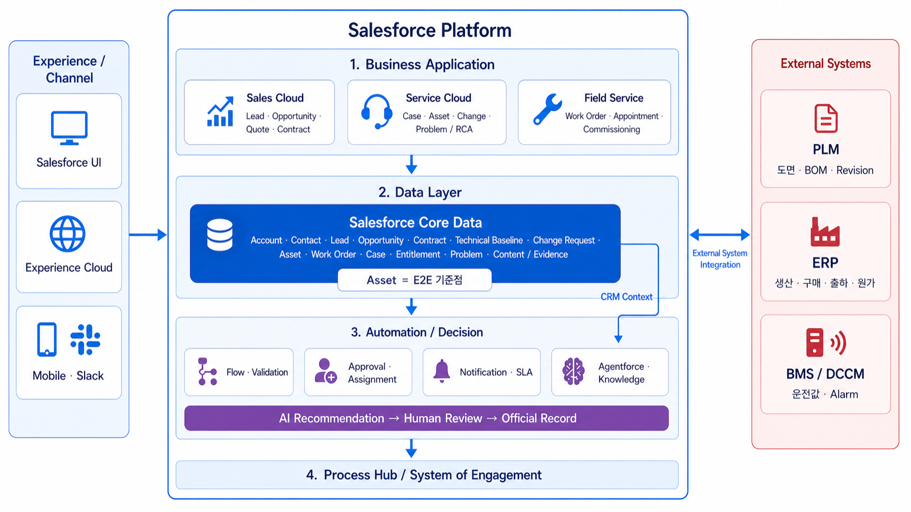
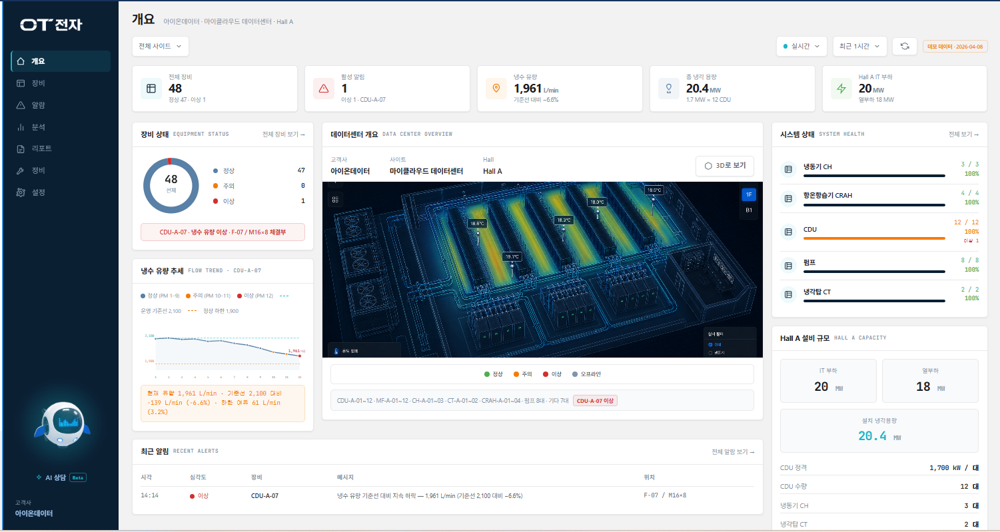
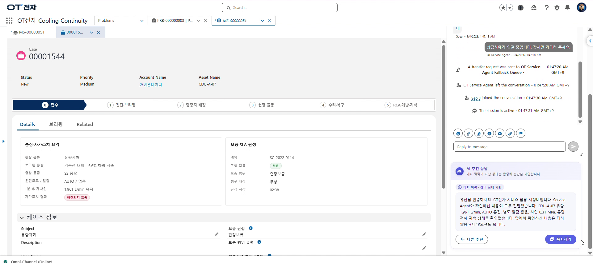
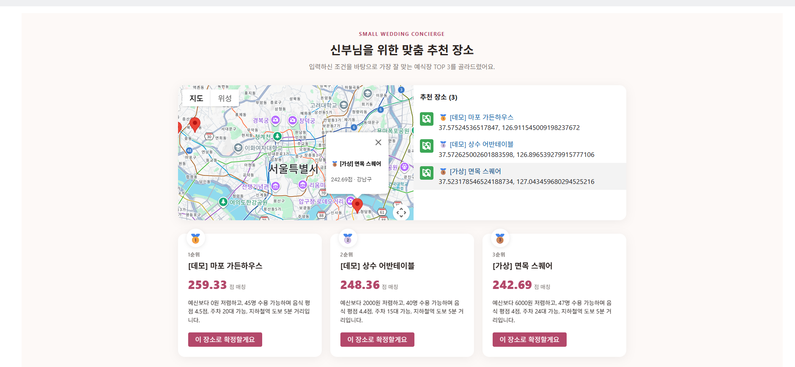
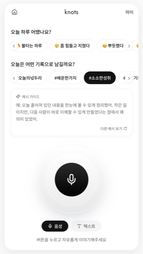
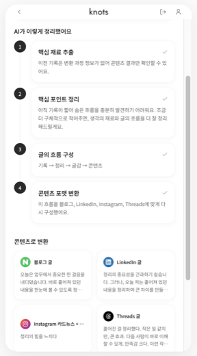

<h1>이유민 (Lee Yumin)</h1>

**데이터를 분석하던 사람에서, 직접 구축하는 Salesforce 개발자로.**

정보통계학과 사회학을 전공하고 마케팅 데이터 분석으로 커리어를 시작했습니다. 분석 결과가 시스템과 업무 프로세스로 이어지지 않으면 일회성에 그친다는 걸 체감하고, 지금은 Salesforce 플랫폼 위에서 리드부터 사후 운영까지를 하나의 데이터 체인으로 잇는 CRM을 만듭니다.

- 🧭 요구사항 정의 → 데이터 모델 → 자동화 → 배포·운영을 한 흐름으로
- ✍️ &ldquo;무엇을, 왜, 어떤 방식으로 만들지&rdquo;를 근거로 정하고 의사결정을 기록으로 남깁니다
- 🤖 Claude Code, Agentforce Vibes 기반 AI-First 개발 — 설계와 검증은 직접
- 📫 lym3303@naver.com

<br>



<sub><b>OT전자 냉각장비 CRM</b> — Salesforce Platform을 4계층으로 구조화하고 <code>Asset</code>을 리드부터 재영업까지 전 여정의 기준점으로 잡았습니다. (직접 설계)</sub>

---

## 대표 프로젝트

### [ot-electronics-crm](https://github.com/dbals12/ot-electronics-crm) — OT전자 냉각장비 CRM

AI 데이터센터용 냉각장비를 **제조 → 설치 → 인수 → 운영 → 재영업**하는 가상기업의 End-to-End Salesforce CRM. 6주간 5인 팀 프로젝트에서 **구축·인수(T3) 트랙을 단독**으로 맡고 **AI 운영 고도화(T5) 이니셔티브를 주도**했습니다. 직접 커밋한 산출물 **Apex 19개, LWC 48개, Flow 23개**.

<table>
  <tr>
    <td width="50%" valign="top">
      
      <br><sub>운영 개요 대시보드 — 장비 상태, 냉수 유량 추세, 냉각 용량 (커스텀 LWC)</sub>
    </td>
    <td width="50%" valign="top">
      
      <br><sub>Experience Cloud 고객 포털 — 장비 상세, 게이지, 측정 이력</sub>
    </td>
  </tr>
  <tr>
    <td colspan="2" valign="top">
      
      <br><sub>상담사 콘솔 — Agentforce 1차 응대 → 상담사 이관(같은 대화 유지), AI 추천 응답, 보증/SLA 자동 판정, Case ↔ Work Order 연동</sub>
    </td>
  </tr>
</table>

`Record-Triggered Flow` `Screen Flow` `Apex (Invocable Action, Controller, REST, @future)` `Platform Event` `Custom Metadata` `Agentforce (Topic, Action, Prompt Template)` `MIAW` `Omni-Channel` `Experience Cloud` `Field Service` `Service Cloud for Slack`

<br>

### [small-wedding-concierge-crm](https://github.com/dbals12/small-wedding-concierge-crm) — 스몰웨딩 컨시어지 CRM

스몰웨딩 장소 추천 컨시어지 업체용 CRM. **개인 프로젝트** — 문제 정의부터 공개 웹폼까지 단독 설계·구축. 비로그인 사용자 접근 제어를 32자 토큰 인증 Apex로 직접 구현하고, 기존 데이터를 보존하며 Opportunity를 확장했습니다.

<table>
  <tr>
    <td width="58%" valign="top">
      
      <br><sub>공개 추천 사이트 — 신부별 개인화 점수 TOP 3, 지도 (LWC, Guest User)</sub>
    </td>
    <td width="42%" valign="top">
      
      <br><sub>상담사용 앱 — Venue 데이터 모델과 추천 이력</sub>
    </td>
  </tr>
</table>

`Guest User Apex (without sharing, 토큰 스코핑)` `Screen Flow (개인화 점수, Collection Sort, TOP-N, 이메일 조립)` `Record Type / Business Process` `Web-to-Lead` `LWC 지도`

<br>

### [knots-ai](https://github.com/dbals12/knots-ai) — AI 커리어 브랜딩 서비스 &nbsp; ([라이브 데모 ↗](https://knots-ai.lovable.app))

3분짜리 음성 메모를 AI가 **핵심 추출 → 포인트 정리 → 글 흐름 구성 → 포맷 변환** 4단계로 처리해 **블로그, LinkedIn, Instagram 카드뉴스, Threads** 콘텐츠로 재생성하는 서비스. 프론트부터 백엔드까지 개인 풀스택 개발.

<p>
  
  &nbsp;
  
</p>
<sub>홈 — 음성/텍스트 입력, 기록 방향 선택 &nbsp;&nbsp; 결과 — 4단계 변환 과정, 플랫폼별 콘텐츠 카드</sub>

```
React (Vite, TypeScript, Tailwind, shadcn/ui)
   │  Supabase Auth
   ▼
Supabase Edge Functions (Deno)
   process-audio           STT
   refine-output           OpenAI, 톤/포맷 반영 재정제
   regenerate-session      세션 전체 재생성
   update-and-regenerate   사용자 편집 반영 재생성
   promote-draft           드래프트 → 확정본
   log-event               사용 이벤트 로깅
   ▼
Supabase Postgres — RLS로 유저별 격리
```

`React` `TypeScript` `Supabase (Auth, Postgres, RLS)` `Edge Functions (Deno)` `OpenAI` `프롬프트 엔지니어링`

<br>

### [yumim](https://github.com/dbals12/yumim) — 마케팅 데이터 분석

고객 데이터를 K-means로 세분화하고 광고 소재를 A/B 테스트로 통계 검증해 **기존 게시물 대비 참여율 282% 향상** (고용노동부 × 면접왕 이형 최우수 수상).

`Python` `pandas` `scikit-learn` `Streamlit` `통계 검정`

---

## 기술 스택

| 영역 | 내용 |
|---|---|
| **Salesforce** | Apex, LWC, Aura, SOQL, Flow (Record-Triggered, Screen, Scheduled, Platform Event), Validation Rule, Approval Process, Custom Metadata Type, Agentforce, Experience Cloud, Service Cloud, Field Service, MIAW, Knowledge, SFDX |
| **Web, 백엔드** | React, TypeScript, Tailwind, Supabase, Deno, Node, REST API |
| **데이터, 분석** | Python, R, SQL (MySQL, BigQuery), pandas, scikit-learn, Tableau |
| **협업, DevOps** | Git, git worktree, GitHub Actions CI, Prettier, ESLint, Jest, Claude Code, Agentforce Vibes |

## 자격, 교육

**SeSAC Salesforce AI CRM 2기** (2026) — Administrator, Apex, LWC, Agentforce / 5인 팀 CRM 구축 프로젝트
**SQLD**, **ADsP** (한국데이터산업진흥원) / **TOEIC 840**, TOEIC Speaking IH / Tableau Bootcamp 수료
